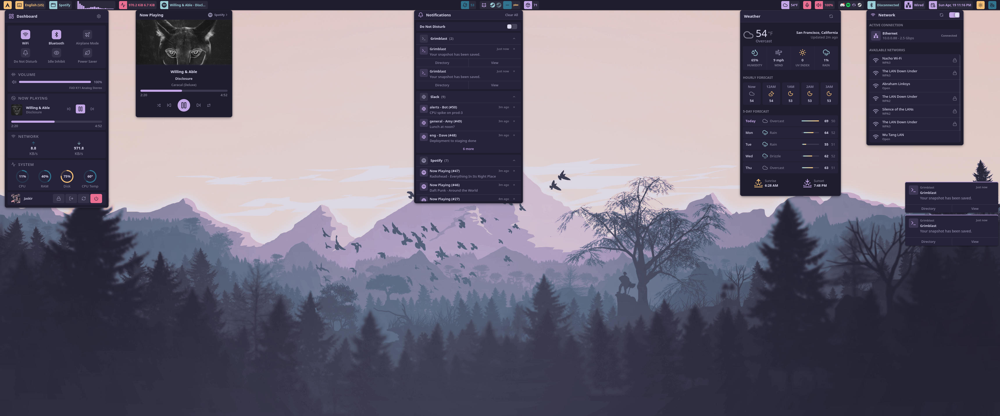
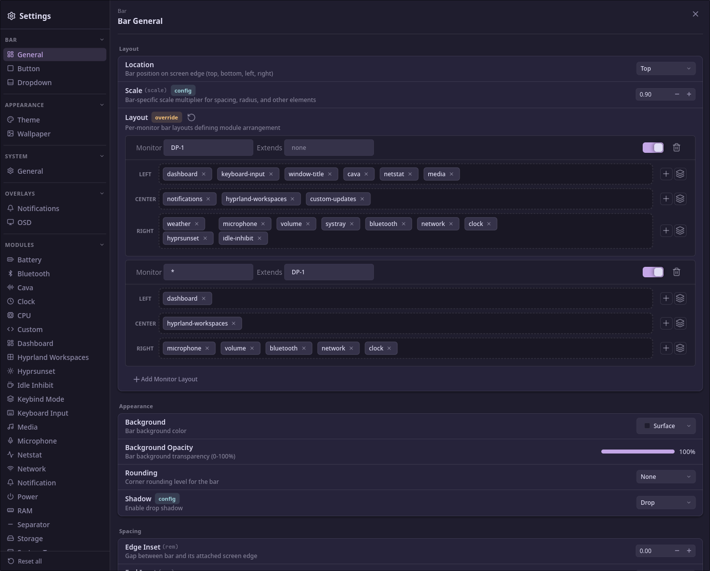

<p align="center">
  <picture>
    <source media="(prefers-color-scheme: dark)" srcset="assets/lumen-lockup-dark.svg">
    
  </picture>
</p>

# Lumen

<p align="center">
  <a href="https://github.com/lumen-rs/lumen/actions"></a>
  <a href="https://github.com/lumen-rs/lumen/blob/main/LICENSE"></a>
  <a href="https://lumen.app"></a>
</p>

A Wayland desktop shell with the bar, notifications, OSD, wallpaper, and device controls built in. Written in Rust with GTK4 and Relm4.

Lumen is arranged as a single Rust workspace. The service crates live locally under `crates/`, so app and service changes can be developed from one checkout.

Configure it in `config.toml`, through the `lumen-settings` GUI, or with the `lumen config` CLI.

<p align="center">
  
</p>

<p align="center">
  
</p>

## Documentation

Full guides, reference, and walkthroughs are at **[lumen.app](https://lumen.app)**.

- [Getting started](https://lumen.app/guide/getting-started) - Installation instructions
- [Editing config](https://lumen.app/guide/editing-config) - File layout, live reload, imports, CLI editing
- [Bars and layouts](https://lumen.app/guide/bars-and-layouts) - Per monitor layouts, groups, classes
- [Themes](https://lumen.app/guide/themes) - Color tokens, theme files
- [Custom icons](https://lumen.app/guide/custom-icons) - Installing icons, icon sources
- [Custom modules](https://lumen.app/guide/custom-modules) - Shell-backed bar modules
- [CLI](https://lumen.app/guide/cli) - Every subcommand
- [Config reference](https://lumen.app/config/) - Full config documentation

## Install

Lumen isn't packaged for any distro yet, so install it from source. Native packages (AUR and others) are planned.

First install the system dependencies for your distro:

<details>
<summary><b>Arch</b></summary>

Install Rust via [rustup](https://rustup.rs), then the system libraries:

```sh
sudo pacman -S --needed git gtk4 gtk4-layer-shell gtksourceview5 \
  libpulse fftw libpipewire systemd-libs clang base-devel
```

Runtime daemons for the battery, bluetooth, network, power, and audio modules (skip any you don't need):

```sh
sudo pacman -S --needed bluez bluez-utils networkmanager upower \
  power-profiles-daemon pipewire wireplumber pipewire-pulse
sudo systemctl enable --now bluetooth NetworkManager upower power-profiles-daemon
```

</details>

<details>
<summary><b>Debian / Ubuntu</b></summary>

Ubuntu 24.04 LTS does not package `libgtk4-layer-shell-dev`. Use Ubuntu 25.04+ or Debian 13 (trixie).

Install Rust via [rustup](https://rustup.rs), then the system libraries:

```sh
sudo apt install git pkg-config cmake libgtk-4-dev libgtk4-layer-shell-dev \
  libgtksourceview-5-dev libpulse-dev libfftw3-dev libpipewire-0.3-dev \
  libudev-dev clang build-essential
```

Runtime daemons:

```sh
sudo apt install dbus-user-session bluez network-manager \
  upower power-profiles-daemon pipewire-pulse wireplumber
sudo systemctl enable --now bluetooth NetworkManager upower power-profiles-daemon
```

</details>

<details>
<summary><b>Fedora</b></summary>

Requires Fedora 42 or later.

Install Rust via [rustup](https://rustup.rs), then the system libraries:

```sh
sudo dnf install git cmake pkgconf-pkg-config gtk4-devel gtk4-layer-shell-devel \
  gtksourceview5-devel pulseaudio-libs-devel fftw-devel pipewire-devel \
  systemd-devel clang gcc
```

Fedora Workstation already ships the runtime daemons. Minimal and Server installs need:

```sh
sudo dnf install pipewire-pulseaudio wireplumber NetworkManager bluez upower \
  power-profiles-daemon
sudo systemctl enable --now bluetooth NetworkManager upower power-profiles-daemon
```

</details>

### Build and launch:

```sh
git clone https://github.com/lumen-rs/lumen.git Lumen
cd Lumen
cargo install --path lumen
cargo install --path crates/lumen-settings
lumen icons setup
lumen panel start
```

On a different distro? See [lumen.app/guide/getting-started](https://lumen.app/guide/getting-started) for the library-version reference.

## Configuration

The config file is at `~/.config/lumen/config.toml`. Changes reload on save:

```toml
[bar]
location = "top"
scale = 1.25

[[bar.layout]]
monitor = "*"
left = ["dashboard"]
center = ["clock"]
right = ["volume", "network", "bluetooth", "battery"]

[modules.clock]
format = "%H:%M"
```

Every field is documented at [lumen.app/config](https://lumen.app/config/).

## Requirements

A Wayland compositor that implements the `wlr-layer-shell` protocol. Compositor-specific modules currently target Hyprland, Niri and Mango; Sway support is planned.

## License

MIT
